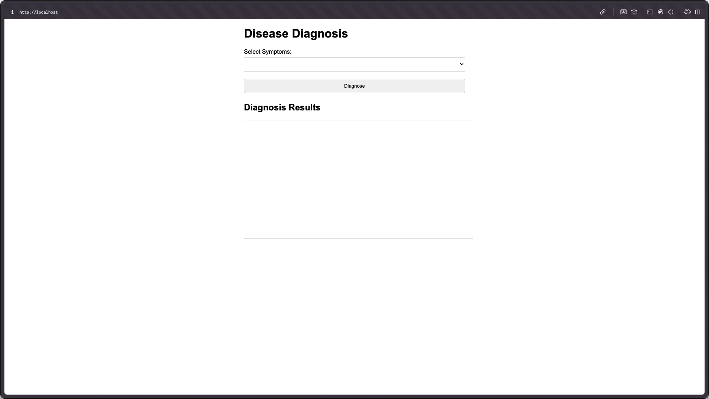

# Amalzen-Disease-Diagnosis
Amalzen Disease Diagnosis is a program for identifying a user's disease based on symptoms using the Prolog Programming Language.

## Setting Up your environment

1. **Install SWI-Prolog**: Ensure you have SWI-Prolog installed on your machine. You can download it from [SWI-Prolog's official website](https://www.swi-prolog.org/Download.html).

2. **Clone the Repository**:
    ```sh
    git clone https://github.com/yourusername/Amalzen-Disease-Diagnosis.git
    cd Amalzen-Disease-Diagnosis
    ```

## Running the Program

You can run the program using either the CLI or the web interface.

### Running via CLI

1. Navigate to the `backend/src` directory:
    ```sh
    cd backend/src
    ```

2. Start the Prolog interpreter:
    ```sh
    swipl
    ```

3. Run the main module:
    ```prolog
    ?- [main].
    ```
4. Follow the on-screen instructions to use the interactive mode or start the web server.
    ```prolog
    Disease Diagnosis System
    1. Interactive Mode
    2. Start Web Server
    3. Exit
    ```

5. If you choose interactive mode Type "1." and your symptom/s:
    ```prolog
    > swipl main.pl

    Disease Diagnosis System
    1. Interactive Mode
    2. Start Web Server
    3. Exit
    |: 1.

    Enter symptoms separated by commas (e.g., fever,cough,sore_throat):
    |: fever
    Possible diseases: [dengue_fever,mpox,covid19,measles,malaria]
    ```

6. Terminate the prolog interpreter:
    - Type "3." or use the halt query
    ```
    ?- halt.
    ```


### Running via Web Interface

1. Navigate to the `backend/src` directory:
    ```sh
    cd backend/src
    ```

2. Run the server using this command:
    ```sh
    swipl -s server.pl -g start_server 
    ```
4. The API will be available at `http://localhost:8090`, you can test it using this terminal command.
    ```sh
    curl "http://localhost:8090/diagnose?symptoms=fever,cough"
    ```
    It should return this diagnosis:
    ```sh
    ["covid19", "measles" ]
    ```

5. To Access the the web interface, open the index html file in your browser:
    ```sh
    open frontend/index.html # For Unix devices
    ```
6. Enter symptoms in the input field and click "Diagnose" to get the diagnosis results.


## Project Structure

- `backend/src/knowledge.pl`: Contains the knowledge base with diseases and their symptoms.
- `backend/src/logic.pl`: Contains the logic for diagnosing diseases based on symptoms.
- `backend/src/main.pl`: Contains the main entry point for the CLI and web server.
- `backend/src/server.pl`: Contains the code for the web server.
- `frontend/index.html`: Contains the HTML file for the web interface.